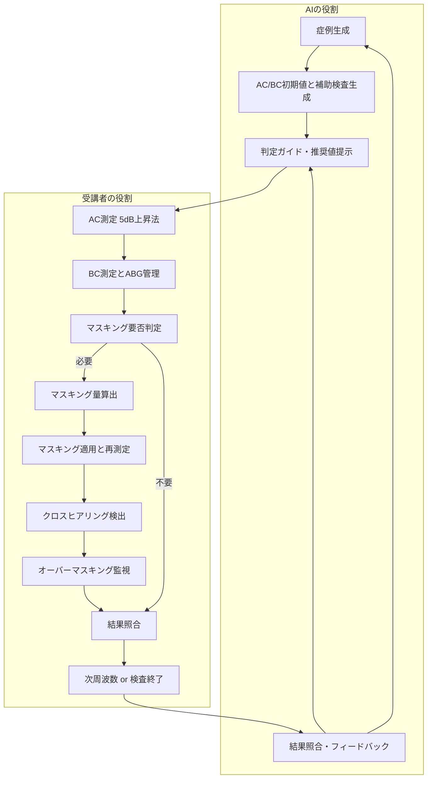

# AI聴覚シミュレーショントレーニング プレゼン資料
## AI症例生成からマスキング判断までを一気通貫で学習するプラットフォーム

---

## スライド1: タイトル
# AI聴覚検査シミュレーション
## 自動症例生成からマスキング判断までの統合トレーニング
### 発表者：＿＿／所属：＿＿／日付：＿＿

---

## スライド2: ゴール
### 本プレゼンで伝えること
- AI が臨床ルール準拠の擬似症例を自動生成
- AC/BC 測定→マスキング判定→結果照合までを模擬
- クロスヒアリング／オーバーマスキング判断を反復学習

### 受講者の到達点
- マスキング量設定の根拠を言語化できる
- クロスヒアリング／オーバーマスキングの兆候を説明できる
- 結果照合とフィードバックの重要性を理解する

---

## スライド3: AI症例自動生成フロー
### ステップ
1. `profile`選定（年齢・性別・疾患・重症度）
2. AC 初期値生成（ISO 正常値＋疾患プロファイル補正）
3. BC 生成（±6dB揺らぎ、ABG制約を想定）
4. 補助検査（Tym／ART／DPOAE）を病態ルールで自動設定
5. 整合性チェック（左右差、患側判定、マスキング要件）

### 特徴
- 実臨床に近いばらつきとルールを両立
- 病態ごとの補助検査結果が一貫している
- 症例データベースに依存せず無限生成

---

## スライド4: AC測定プロセス
### 操作フロー
1. AI症例の AC 初期値を提示
2. 受講者が **5dB上昇法**（聴取不可レベルから 5dB ずつ上げる）で応答を確認
3. 閾値仮決定→ログに記録→次周波数へ

### ルール
- ISO 基準に合わせた提示レベル範囲
- `Scale-Out` 超過時は測定限界表示
- 左右差が大きくなり過ぎないようガード

---

## スライド5: BC測定 & ABG管理
### BC値生成
- ランダム揺らぎ（±6dB／5dB刻み）
- 伝音性の場合は最小 ABG を確保
- 正常・SNHL は `-10dB ≤ AC-BC ≤ +5dB`

### 測定時の確認ポイント
- 受講者が上昇法で応答を記録し、仮閾値と AC の差から ABG を算出
- 最小 ABG未満なら AC を補正
- 40dB 超の ABG は自動的に抑制

---

## スライド6: マスキング要否判定ロジック
### 条件評価（受講者が判断）
- ABG が疾患別最小値以上か
- 左右差が IA を超える見込みか
- テスト耳閾値がマスキングノイズで覆われないか

### システムのサポート（AI）
- 条件を満たす周波数をハイライト
- 必要なマスキング操作をガイダンス
- 判定ミス時に根拠をフィードバック

---

## スライド7: マスキング量算出
### 推奨計算（受講者が手計算）
- 気導：`TE AC + セーフティマージン - IA`
- 骨導：`TE BC + セーフティマージン`
- セーフティマージンは 10dB を基準に調整

### アプリでの表示（AI サポート）
- 推奨値と設定欄を並列表示
- 入力値と推奨値の乖離をリアルタイム判定
- 適正範囲／過小／過大を色分け

---

## スライド8: クロスヒアリング監視
### 監視ポイント
- マスキング下で意図しない応答がないか
- 対側閾値との関係から cross-check
- BC 測定時の反対耳への伝播に注意

### システム挙動
- 応答パターンからクロスヒアリング疑いを検出
- 指摘時は追加マスキングの提案を表示
- 学習者に判断理由をフィードバック

---

## スライド9: オーバーマスキング対策
### 判定
- マスキングノイズが test ear に漏れ込む兆候
- 閾値上昇や応答消失を監視

### 対応フロー
- マスキングレベルを段階的に減少
- 再測定で閾値を再確認
- ルールに沿った最適値を提案

---

## スライド10: 全体フローチャート

---

## スライド11: UIとフィードバック
### 学習者画面
- Audiogram ビュー＋マスキング入力欄
- 推奨値・警告表示・アドバイス
- 補助検査タブ（Tym／ART／DPOAE）

### フィードバック機能
- 応答履歴と閾値差分を可視化
- 過小／過大の理由をコメント表示
- 学習ログで苦手傾向を分析

---

## スライド12: まとめと次ステップ
### まとめ
- AI 症例生成で臨床的に自然な基礎データを用意
- 5dB下降法→マスキング設定→結果照合の一連を反復学習
- クロスヒアリング／オーバーマスキングを計画的に体験

### 次ステップ
- 追加シナリオ（重症度・疾患拡張）の投入
- 結果レポートの自動生成
- LMS/実機連携の検証と導入

---

