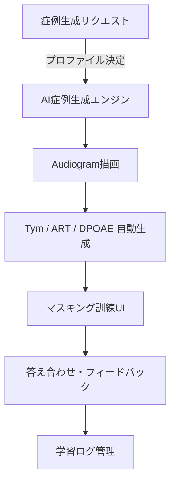

# AI聴覚シミュレーショントレーニング プレゼン資料
## 臨床現場を再現したAI症例生成とマスキング訓練プラットフォーム

---

## スライド1: タイトル
# AI聴覚シミュレーション・トレーニングプラットフォーム
## 臨床現場を再現したAI症例生成と聴力検査シミュレーション
### 発表者：＿＿／所属：＿＿／日付：＿＿

---

## スライド2: 背景と課題
### 現場課題
- マスキング値設定は経験依存が大きく習得が難しい
- 症例データ不足で体系的なトレーニングが困難
- 実機利用は高コスト・場所制約が大きい

### 教育ニーズ
- 臨床ルールに沿った擬似症例の大量供給
- 判断プロセスを可視化する教材
- ブラウザだけで再現可能な訓練環境

---

## スライド3: ソリューション概要
### プラットフォームの核
- AI が年齢・性別・疾患・重症度を含む擬似患者を自動生成
- オージオグラム／Tym／ART／DPOAE を一貫した結果として自動構築
- マスキング値決定の訓練フローを実臨床ルール準拠で再現

### 期待効果
- いつでもどこでもマスキング判断を練習
- 症例の多様性確保で学習効率を向上
- 臨床思考を伴う教育コンテンツを低コストで提供

---

## スライド4: AI症例生成フロー
### 自動生成ステップ
1. プロファイル決定（性別・年齢・疾患・重症度）
2. AC/BC 閾値生成（BC ±6dB揺らぎ、ABG ルール適合）
3. 補助検査生成（Tym／ART／DPOAE を病態ルールで設定）
4. 整合性チェック（左右差・患側判定・マスキング条件の確認）

### 主要ルール
- 正常・SNHL：AC-BC を -10〜+5dB に制約
- CHL：ABG 最大40dB、疾患別に最小ABGを確保
- 離断例：患側ARTはIPSI/CONT欠如、健側CONT閾値上昇
- Tym 縦軸はコンプライアンス>2.0mLで自動的に5.0mLへ拡張

---

## スライド5: マスキング訓練フロー
### 手順再現
1. 擬似患者のオージオグラム提示
2. 受講者がマスキングレベルを入力
3. システムが適否を判定し、必要なら補正値のヒントを提示
4. 誤差・根拠をフィードバックし、判断ロジックを可視化

### 特徴
- スイープ操作は省き、マスキングレベル決定に集中
- 右左／患側健側の切り替えやクロスヒアリング警告を再現
- 反復で閾値設定ルールが自然に身に付く

---

## スライド6: 学習者UIハイライト
### 主要画面要素
- Audiogram ビューとマスキング入力パネル
- Tym／ART／DPOAE タブで補助検査を確認
- 答え合わせカードに原プロファイル名（例：SNHL_Sudden）を表示
- 臨床メモ／ヒント表示で判断根拠を解説

### インタラクション
- 入力値に応じてリアルタイムに結果を更新
- 誤判定時は原因と正解の幅を提示
- 症例履歴を蓄積し、苦手傾向を分析可能

---

## スライド7: 臨床ルールの組み込み
### Audiogram
- AC/BC 差の上下限・左右相関をルール化
- BC 値のランダム揺らぎで実症例に近いバリエーション

### Tympanogram
- 患側のみコンプライアンス上昇／健側は正常値を維持
- コンプライアンス2.0mL超でY軸を自動拡大

### ART・DPOAE
- 病態ごとの反射欠如／閾値上昇／PASS/REFER条件を定義
- 補助検査間の矛盾を自動検出し修正

---

## スライド8: 臨床教育へのインパクト
### 教育効果
- マスキング判断を数多く体験し臨床感覚を養成
- 症例ごとに補助検査を確認し総合的な診断思考を訓練
- ルールベースのフィードバックで理解を深化

### 運用メリット
- Webブラウザのみで利用、設備投資不要
- 学習ログ管理で指導者が進捗を把握
- 症例生成の重み付けを排除し、広範な病態を均等学習

---

## スライド9: システム構成（Mermaid）

---

## スライド10: 導入・展開シナリオ
### 主な利用先
- 大学・専門学校の聴覚検査実習
- 医療機関の新人研修やリカレント教育
- 個人学習者の資格試験対策

### ビジネスモデル例
- 教育機関向け年間ライセンス
- 医療機関向け施設パッケージ
- 個人向けサブスクリプション＋症例パック

---

## スライド11: 開発状況とロードマップ
### 現在の実装
- AI症例生成・補助検査自動描画を実装済み
- マスキング訓練UIとフィードバックロジックを実装
- GitHub / Vercel で継続的デプロイ運用

### 今後の計画
- 訓練シナリオの拡充（症例・難易度設定）
- LMS連携・学習分析機能の追加
- 実機インターフェース（オージオメータI/O）との接続検証

---

## スライド12: まとめ
### 提供価値
- 臨床ルール準拠のAI擬似患者でマスキング判断を体系学習
- 補助検査との整合を保ち臨床思考を深める教育体験
- 教育・研修・特許戦略に活用可能な先進的プラットフォーム

### 次のアクション
- デモ提供・導入検討先への提案
- 学習ログ活用による指導者支援機能の設計
- 特許出願と事業化準備の加速

---

