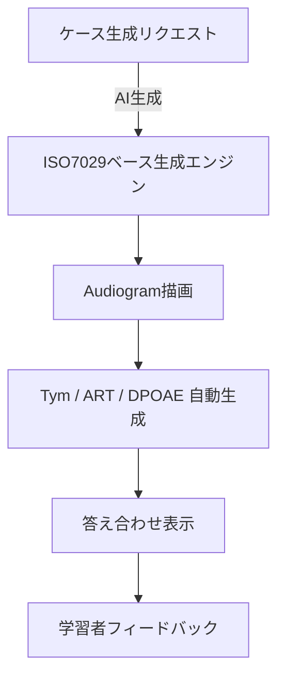

<!-- GitHub 上で Mermaid 図を確認したい場合は、このファイルの内容をプレビューしてください -->

# システム構成図 (Mermaid)

以下の Mermaid 記法は GitHub の Markdown プレビューや VS Code の Mermaid 対応プラグインでそのまま描画できます。

## 表示方法

- GitHub リポジトリ上で `docs/system_diagram.md` を開き、「Raw」ではなく通常のビューを表示すると図がレンダリングされます。
- GitHub Pages や Vercel 上の Markdown ビューアでも Mermaid 対応であれば同様に描画されます。
- ローカルで確認したい場合は VS Code の「Markdown Preview Mermaid Support」などの拡張機能を利用してください。

