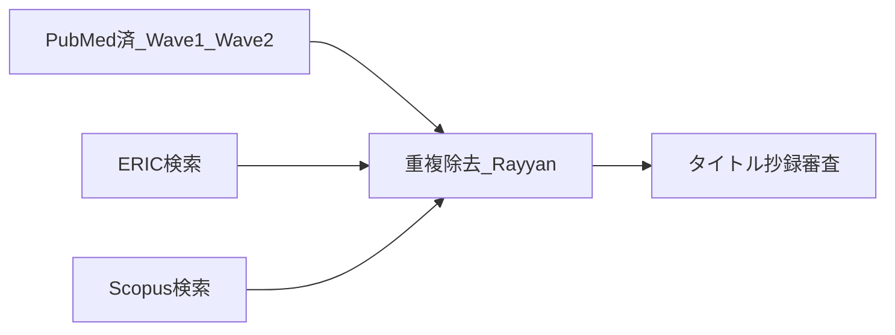

# Paper 1 検索戦略 — PubMed × ERIC × Scopus

| 項目 | 内容 |
|------|------|
| 確定日 | 2026-07-15 |
| 方針 | **本検索DBは3つ**: PubMed / MEDLINE、ERIC、Scopus |
| 対象年 | 2000–最新 |
| 言語 | 英語を優先（日本語は今回スコープ外／限界に記載） |
| 報告 | PRISMA-ScR（情報源を3 DBとして明記） |
| 重複除去 | Rayyan または DOI／題名マッチ後にフロー図へ |

**やらない（今回）**: Web of Science、CINAHL、CiNii、医中誌、Embase、Google Scholar網羅  
→ Methods／限界で「英語中心・3 DB」と書く。

---

## 概念ブロック（共通）

| ブロック | 概念 |
|----------|------|
| **A** | 聴覚検査・オージオロジー臨床検査（PTA／マスキング中心、関連検査可） |
| **B** | 教育・訓練・カリキュラム・学生・シミュ（教育文脈） |

結合: **A AND B**（シミュ限定の第3ブロックは付けない）

**2026-10-01 確認:** 聴力検査 AND シミュレータ AND 教育、と第3ブロックでシミュレータを必須にした式は PubMed で 239件だった。Delphi、OSCE、マスキング学習の調査が落ちるため **不採用**。主式は下の 886件のまま。

---

## 1. PubMed（主式更新・2026-07-21）

詳細ログ: [`screening_results_Paper1_main886_rescreen.md`](./screening_results_Paper1_main886_rescreen.md)  
CSV: [`rayyan_import_PubMed_Paper1_main886.csv`](./rayyan_import_PubMed_Paper1_main886.csv)

| 層 | 式 | ヒット | 役割 |
|----|-----|--------|------|
| **現行主式** | 下掲（教育は主に `[ti]`、シミュは `[tiab]`） | **886**（2000–） | **一次コア** |
| 旧案C（参考） | 教育・シミュともタイトル寄せ | 278 | 新主式に**完全内包**（lost 0） |
| 感度／Wave2 | 旧感度＋狙い撃ち | — | ABR／Delphi／Pediatric VP 等、主式外の補完 |

```
# 主式（2026-07-21 採用）
(
  "Audiometry"[Mesh]
  OR audiometr*[tiab]
  OR "pure tone"[tiab]
  OR "pure-tone"[tiab]
  OR "clinical masking"[tiab]
  OR "audiometric masking"[tiab]
)
AND
(
  education*[ti]
  OR train*[ti]
  OR teach*[ti]
  OR curricul*[ti]
  OR student*[ti]
  OR pedagog*[ti]
  OR instruction*[ti]
  OR learn*[ti]
  OR simulator*[tiab]
  OR simulation[tiab]
  OR "simulation training"[tiab]
  OR "virtual audiometer"[tiab]
  OR "virtual audiometry"[tiab]
  OR "audiometer trainer"[tiab]
  OR "simulated audiometer"[tiab]
  OR "computer-assisted instruction"[tiab]
  OR "computer based instruction"[tiab]
  OR "computer-based instruction"[tiab]
  OR "web-based training"[tiab]
  OR "web based training"[tiab]
  OR "virtual patient"[tiab]
  OR (
    (masking[tiab] OR mask*[tiab])
    AND
    (education*[tiab] OR train*[tiab] OR teach*[tiab]
     OR learn*[tiab] OR student*[tiab])
  )
)
AND ("2000/01/01"[Date - Publication] : "3000"[Date - Publication])
```

**再スクリーニング（+608）:** 新規 Include なし。CARL（42324719）と VP 2023（37591217）が主プールに入った（もともと Include+）。+606は ML／知覚学習等のノイズ。

---

## 2. ERIC

**どこで**: [eric.ed.gov](https://eric.ed.gov)（無料）または EBSCO ERIC

### 広め（パイロット）— 2026-07-15: **1163件** → 本審査には不採用（過多）

```
(audiometry OR audiometric OR "pure tone" OR "pure-tone" OR masking OR "hearing test" OR audiology OR audiologist) AND (education OR training OR teaching OR curriculum OR student OR pedagogy OR simulation OR simulator OR "clinical education")
```

### 採用（狭い式）— 2026-07-15: **82件**

```
(audiometry OR "pure-tone" OR "pure tone" OR "hearing test" OR audiometric) AND (audiology OR audiologist OR "speech-language" OR "communication disorders") AND (education OR training OR teaching OR curriculum OR simulation OR simulator OR student OR students)
```

制限: Peer reviewed（可なら）、Publication Date Since 2000  
Methods: 広め（1163）は感度確認のみ。スクリーニング用は本式（82）。

### 予備（タイトル寄せ・必要時）

Advanced Search で:
- **Title**: `audiometry OR audiometric OR "pure tone" OR masking OR "hearing test"`
- **AND Title or descriptor**: `education OR training OR curriculum OR student OR simulation`

または1行:

```
title:(audiometry OR audiometric OR "pure-tone" OR "hearing test") AND (education OR training OR curriculum OR simulation OR student)
```

### 出力

- CSV または RIS → 変換して Rayyan  
- ファイル名案: `rayyan_import_ERIC_Paper1.csv`  

**注意**: ERICは医学語が弱い。`audiology`＋`education`でも良いヒットが出る。過度に狭めすぎない。

---

## 3. Scopus

**どこで**: [scopus.com](https://www.scopus.com)（機関アクセス）

**注意**: `*` ワイルドカードはエラーになりやすい → 展開語で書く。式は**1行**で貼る。

### 広め（パイロット）— 2026-07-15: **4052件** → 本審査には不採用（ノイズ過多）

```
TITLE-ABS-KEY((audiometry OR "pure-tone" OR "pure tone" OR "clinical masking" OR "hearing test") AND (education OR training OR teaching OR curriculum OR pedagogy OR pedagogical OR student OR students OR simulation OR simulator OR "e-learning" OR "clinical education")) AND PUBYEAR > 1999
```

### 採用（TITLE寄せ・PubMed案C相当）— 2026-07-15: **203件**

```
TITLE((audiometry OR audiometric OR "pure-tone" OR "pure tone" OR masking OR "hearing test") AND (education OR educational OR training OR teaching OR curriculum OR student OR students OR pedagogy OR pedagogical OR simulation OR simulator OR "e-learning" OR instructional)) AND PUBYEAR > 1999
```

Methods: 広め（4052）は感度確認のみ。スクリーニング用は本式（203）。

### 予備（さらに狭く・必要時）

```
TITLE((audiometry OR "pure-tone" OR "pure tone" OR "clinical masking") AND (education OR training OR teaching OR curriculum OR simulation OR simulator OR student OR students)) AND PUBYEAR > 1999
```

### 出力

- RIS / CSV → Rayyan  
- ファイル名案: `rayyan_import_Scopus_Paper1.ris`  
- PubMed重複は多い想定。**新規のみ**をスクリーニングし、フロー図に「Scopus unique」を書く

---

## 4. 作業順（推奨）



1. Wave2（PubMed由来候補）の OK/NG を進める／並行可  
2. ERIC実施 → ユニークのみ審査  
3. Scopus実施 → ユニークのみ審査  
4. 3 DB 合算で PRISMA フロー完成 → 地図 v1.1

---

## 5. 実施ログ（記入用）

| 日付 | DB | 式（略称） | ヒット | Rayyan投入 | ユニーク新規 | 備考 |
|------|-----|------------|--------|------------|--------------|------|
| 2026-07-14 | PubMed | 案C（旧） | 278 | 済 | — | 旧主式。2026-07-21に886式へ置換 |
| 2026-07-21 | PubMed | **主式886** | **886** | [`rayyan_import_PubMed_Paper1_main886.csv`](./rayyan_import_PubMed_Paper1_main886.csv) | 旧278を内包 | +608再審査→追加Includeなし。CARL/VP2023が主プール昇格 |
| 2026-10-01 | PubMed | シミュ必須の別案 | 239 | 不採用 | — | A AND シミュ AND 教育。Delphi・OSCE・マスキング調査が落ちる |
| | PubMed | Wave2狙い撃ち | — | 台帳 | 53候補 | 審査中 |
| 2026-07-15 | ERIC | 広め | **1163** | 不採用 | — | パイロットのみ |
| 2026-07-15 | ERIC | **狭い式** | **82** | [`rayyan_import_ERIC_Paper1.csv`](./rayyan_import_ERIC_Paper1.csv)（元: `.nbib`） | （Dedup後） | **本検索採用** |
| 2026-07-15 | Scopus | TITLE-ABS-KEY広め | **4052** | 不採用 | — | パイロットのみ |
| 2026-07-15 | Scopus | **TITLE寄せ** | **203** | [`rayyan_import_Scopus_Paper1.csv`](./rayyan_import_Scopus_Paper1.csv) | Dedup後 ≈431–432 | **本検索採用・Abstract付き** |
| 2026-07-15 | Rayyan | PubMed278+Scopus203 | 481 | Dedup | unresolved→0（49 merge / **1 not duplicate**） | ユニーク ≈ **432** |
| 2026-07-15 | ERIC | 狭い式 | **82** | [`rayyan_import_ERIC_Paper1.csv`](./rayyan_import_ERIC_Paper1.csv) | | Import後Rayyanエラー |
| 2026-07-15 | **ローカルDedup** | 3DB合算563 | **537** | [`rayyan_import_Paper1_merged_dedup.csv`](./rayyan_import_Paper1_merged_dedup.csv) | Rayyan新レビュー **537** 確定 | Dedup追加は不要（Rayyan誤検知あり・無視） |

---

## 6. Methods 用一文（下書き）

> We searched PubMed/MEDLINE, ERIC, and Scopus from 2000 onward using combinations of terms for audiometry/hearing assessment and education/training/curriculum/simulation. Records were deduplicated and screened in Rayyan against pre-specified eligibility criteria (learners as professionals or students in hearing-test education). Results are mapped narratively according to PRISMA-ScR.
